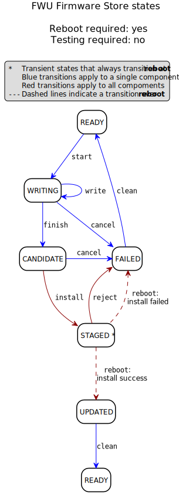
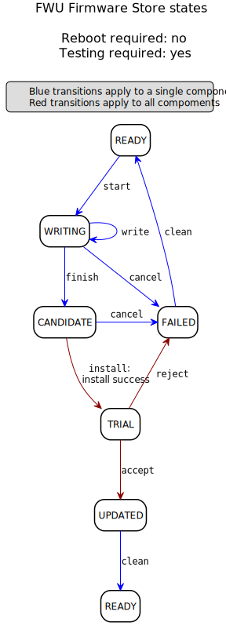
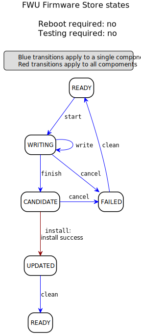

A state model for Firmware Update
=================================

The version 0.7 specification defines a state model based around the lifecycle of a firmware image. It looks like this:

.. image:: permitted-state-transitions.svg
    :width: 75%

A state model based on an image state is informative, but is not the best basis for the Firmware Update API. In the process of updating a single firmware component, the current installed firmware is maintained while a new image is be prepared, verified, and tested; prior to committing to the new firmware image.

It is more helpful to track the state of the Firmware store, that contains these images for a component. From the firmware store state, the states of the individual images can be inferred.

Firmware Components
-------------------

Firmware is likely to be split into logical components that apply to a single element inside a device, e.g. the main firmware, the radio module, the secure processing environment, and so on. Firmware components are referred to by a single numerical identifier, unique for each element in the device. Assigning those numbers and sharing them between the Update Client and the Update Service is not specified here and is implementation-defined. This is most likely done at build or integration time.

The Firmware update state model described here applies separately to the firmware store for each component.

Analysis
--------

When the client first runs after a system restart, it needs to query the state of Firmware Update for each firmware component. The response is used to determine if any FWU operations are required.

For a firmware component, depending on the state or progress of a firmware update, there can be one or more firmware images currently in the firmware store:

1. An image that is actively in use by the system.
2. An image that is being prepared for installation.
3. A 'backup' of a previously installed image, used to recover if an attempted update fails.
4. An expired, rejected, or incomplete image, that can be erased.

Assuming that the firmware component is essential for system operation, there will always be exactly one image of type (1). Other images might, or might not, be present in the store.

Although a Firmware store in a specific system might have storage for more than two firmware images, we define a state model for the Firmware Store that only requires two. This is possible because the store does not need to hold more than one firmware image of type (2), (3), or (4) concurrently. The implementation can have storage for more than two images, and will select the appropriate storage area for a requested operation.

Instead of identifying a physical storage location (sometimes referred to as a 'bank' or 'slot') for the firmware images, the API uses the following (*working names*) for the two required locations:

========  =========  ===========
Location  Present    Description
========  =========  ===========
*Active*  Always     The image that is actively in use by the system
*Second*  Sometimes  An image that is being prepared, or is kept for recovery, or needs to be erased
========  =========  ===========

Depending on the system and memory design, the *active* and *second* locations can be fixed physical storage locations, or can refer to different physical storage locations over time as an update progresses. The implementation of the API is responsible for mapping the logical storage locations to the stored firmware images.

During the course of an update, a specific firmware image can change from being *active* to *second*, or from *second* to *active*. For example:

* An image will switch from being *second* --- while being prepared --- to *active* following installation.
* An image will switch from being *active* to *second* when it becomes the backup image during installation of new firmware.

Firmware Store state model
--------------------------

A persistent state model for an in-progress Firmware Update is required for two reasons:

1. When updating firmware that is essential for system operation, a system restart is required to complete installation, and start executing the new system firmware. Communication between the runtime system and the Bootloader regarding the required installation operations must be done via memory.
2. On constrained devices, the download of a new firmware image may take a long time, due to bandwidth or power limitations. A device restart should not invalidate the update progress that has already occurred.

The basic flow required to update firmware within the constraints and meeting the requirements identified for the API is captured in the existing v0.7 document.

For version 1.0, we propose to present the same operational flow as a state model of the **Firmware Store**, instead of an **individual image**, and the existing APIs will work to cause transitions within this alternative state model.

Note
    Although readers might be familiar with the v0.7 image lifecycle-based state model, the definition of a Firmware Store-based state model is clearer without providing explicit linkage to the image states defined in v0.7.

Firmware Store states
~~~~~~~~~~~~~~~~~~~~~

The proposed set of Firmware Store states is as follows:

.. list-table::
    :header-rows: 1

    * - State
      - Description

    * - READY
      - This is the normal state for the Store, where there is just one image, the *active*, which is currently in use by the system.

        The Store is ready for a new firmware update to be started.

    * - WRITING
      - The Client is writing a new firmware image to the *second*, in preparation for installation.

        When writing is complete, it can be installed.

    * - STAGED
      - Installation of the *second* has been requested, but the system must be restarted as the final update operation runs within the Bootloader.

        This state is transient.

    * - FAILED [a]_
      - An installation of the *second* has been attempted, but has failed for some reason. The failure reason is recorded in the Store.

        The *second* needs to be cleaned before another update can be attempted.

    * - TRIAL
      - Installation of the *second* has succeeded, and is now the *active* running in 'trial mode'. This state is transient, and requires the Client to explicitly accept the trial to make the update permanent.

        In this state, the previously installed *active* image is preserved as the *second*. If the trial is explicitly rejected, or the system restarts without accepting the trial, the previously installed image is re-installed and the trial image is rejected.

    * - REJECTED [b]_
      - The *active* trial image has been rejected, but the system must be restarted so the Bootloader can revert to the previous image (saved as the *second*).

        This state is transient.

    * - UPDATED [c]_
      - The *active* trial image has been accepted, and is now permanently active.

        The *second* contains the now-expired previous firmware image, which needs to be cleaned before another update can be started.

.. [a] The FAILED state is required to enable a Client to detect that an attempted installation failed during `reboot`, and determine the reason for the failure.

.. [b] The REJECTED state has limited difference from TRIAL, other than that it records that the trial has been explicitly rejected. However, this approach specifically prevents the Client accepting a trial after rejecting it; and enables other TRIAL policies to be implemented, such as permitting a limited number of restarts before automatically reverting to the previous image.

.. [c] The UPDATED state always transitions to READY before starting a new update. Although the `clean` and `start` transitions could be merged, the separation of the states enables a possibly expensive `clean` operation to be called independently of starting a new update.

The full set of states is necessary for components that require both of the following:

1. A reboot is required to complete installation of a new image
2. The image must be tested prior to acceptance

The following descriptions of the `state model <state transitions_>`_ and `transition matrix <state matrix_>`_ are for this type of component.

For components that do not require testing of new firmware before acceptance, or components that do not require a reboot to complete installation, only a subset of these states are visible to the Update Client. Some common variations are `described later <variations_>`_, including the impact on the state model for such components.

.. _reboot trial model:

State transitions
~~~~~~~~~~~~~~~~~

The state transitions occur either as a result of an API call from the Client, or when the Bootloader carries out an installation operation. The installation operations that occur when the Bootloader runs are determined by the state of the Firmware Store, and do not depend on the reason for the restart. To ensure a specific action occurs at restart, the Client uses the appropriate API to set the state of the Firmware Store.

The Client can trigger transitions in the state model using the following operations:

* ``start``
* ``write``
* ``install``
* ``clean``
* ``accept``
* ``reject``

Some transitions can only be triggered by a system restart, which will run the Bootloader. For these transitions it does not matter how the reboot was triggered.

The typical flow through the states is shown in this graphic:

.. image:: fwu-states-simple.svg

The depicted flow does not show the behavior in error scenarios, except for the transitions over reboot where a failure can only be reported to the Client by changing the state of the Firmware Store.

The READY state at the end is different to the one at the start --- the *active* firmware image is the updated version. The Firmware Store is ready to start the process again from the beginning for the next update.

.. _state matrix:

State/operation transition matrix
~~~~~~~~~~~~~~~~~~~~~~~~~~~~~~~~~

.. list-table::
    :header-rows: 2
    :stub-columns: 1

    * -
      - Operation
      -
      -
      -
      -
      -
      -
    * - State
      - ``start``
      - ``write``
      - ``install``
      - ``reboot``
      - ``accept``
      - ``reject``
      - ``clean``

    * - READY
      - Begin update →WRITING
      - *Error*
      - *Error*
      - no effect
      - *Error*
      - *Error*
      - no effect
    * - WRITING
      - *Error*
      - Write to *second*
      - Verify *second* →STAGED
      - no effect
      - *Error*
      - *Error*
      - Clean *second* →READY
    * - STAGED
      - *Error*
      - *Error*
      - *Error*
      - if install successful:
          Swap images →TRIAL
        else:
          Record error →FAILED
      - *Error*
      - *Error*
      - Clean *second* →READY
    * - FAILED
      - *Error*
      - *Error*
      - *Error*
      - no effect
      - *Error*
      - *Error*
      - Clean *second* →READY
    * - TRIAL
      - *Error*
      - *Error*
      - *Error*
      - Swap images →FAILED
      - Lock in update →UPDATED
      - Reject update →REJECTED
      - *Error*
    * - REJECTED
      - *Error*
      - *Error*
      - *Error*
      - Swap images →FAILED
      - *Error*
      - *Error*
      - *Error*
    * - UPDATED
      - *Error*
      - *Error*
      - *Error*
      - no effect
      - *Error*
      - *Error*
      - Clean *second* →READY

.. _variations:

Variation in system design parameters
~~~~~~~~~~~~~~~~~~~~~~~~~~~~~~~~~~~~~

Depending on the system design and product requirements, an implementation can collapse a chain of transitions for a component, where this does not remove information that is required by the Client, or compromise other system requirements. This can result in some states and transitions being eliminated from the state model for that component's firmware store.

Some possible variations are the following:

===============  ==============  ===========
Reboot required  Trial required  Description
===============  ==============  ===========
Yes              Yes             See `full state model <reboot trial model_>`_
Yes              No              See `no-trial model <reboot notrial model_>`_
No               Yes             See `no-reboot model <noreboot trial model_>`_
No               No              See `basic state model <noreboot notrial model_>`_
===============  ==============  ===========

.. _reboot notrial model:

Components that require a reboot, but no trial
^^^^^^^^^^^^^^^^^^^^^^^^^^^^^^^^^^^^^^^^^^^^^^

If a component does not require testing before committing the update, the the TRIAL and REJECTED states are not used. The `reboot` operation that installs the firmware will transition to UPDATED on success, or FAILED on failure. The `accept` and `reject` operations are never used.

The simplified flow is as follows:

.. _noreboot trial model:

Components that require a trial, but no reboot
^^^^^^^^^^^^^^^^^^^^^^^^^^^^^^^^^^^^^^^^^^^^^^

If a component does not require a reboot to complete installation, the STAGED state is not required. The `install` operation will complete the installation immediately, transitioning to TRIAL if successful (see `Open issues`_ regarding the behavior on a failed installation).

This use cases also removes the REJECTED state, because the `reject` operation also does not require a `reboot` to complete. A `reject` operation from TRIAL states transitions directly to FAILED.

The simplified flow is as follows:

*Notes*

1. It is not strictly necessary to provide a state from which the Client can determine the installation failure or rejection reason, as these operations do not occur over a `reboot`. The FAILED state could be eliminated for this use case, with `reject` incorporating the `clean` operation.

2. There is no ability for the Update Service to automatically reject a TRIAL, because the "`reboot` without `accept`" condition used for this purpose in the full state model is not available in this use case.

.. _noreboot notrial model:

Components that require neither a reboot, nor a trial
^^^^^^^^^^^^^^^^^^^^^^^^^^^^^^^^^^^^^^^^^^^^^^^^^^^^^

If a component does not require a reboot to complete installation, and does not require testing before committing the update, then
the STAGED, TRIAL, REJECTED, and FAILED states are not required. The `install` operation will complete the installation immediately, transitioning to UPDATED if successful (see `Open issues`_ regarding the behavior on a failed installation).

The simplified flow is as follows:

Open issues
-----------

Transitions in error scenarios
~~~~~~~~~~~~~~~~~~~~~~~~~~~~~~

The existing specification states that when an operation fails, the state should remain unchanged. However, the state diagrams show some transitions on failure to REJECTED state, for example if `install` fails.

Transitions to a new state are necessary when a `reboot` occurs, and the Bootloader action fails. For example, if a STAGED image cannot be installed because of a failed verification check.

Should we specify the required behavior for other failed operations, such as a verification or dependency failure during `install`? Requiring a state change to FAILED does prevent a Client from attempting to call `install` again (and repeating a check that will fail). But if we do this, what about errors during `write`?

We could permit implementations to make a transition - and leave it implementation-defined. It might be necessary to do so, as the state is persistent, and the process of changing the state involves updates to storage - and making such updates behave atomically could be prohibitive. In this scenario, permitting the implementation to record that the component is in FAILED state is probably preferable to mandating that it recovers to the prior state.

Support for variations
~~~~~~~~~~~~~~~~~~~~~~

The section on variations_ describes three additional component update use cases, based on whether a reboot is required to complete installation, and whether the image must be tested before finalizing the update.

Are all of these use cases important for documenting in version 1.0?

------

Appendix: Operation comparison with v0.7
----------------------------------------

Most of the Client operations align with the functions in the v0.7 API. This RFC proposes some changes related to the start of the update process, and renaming of the ``start``, ``reject`` and ``clean`` operations. The following table summarizes the relationship:

==============       =============
v1.0 operation       v0.7 API name
==============       =============
``start``            ``psa_fwu_set_manifest()``
``write``            ``psa_fwu_write()``
``install``          ``psa_fwu_install()``
``reject``           ``psa_fwu_request_rollback()``
``accept``           ``psa_fwu_accept()``
``clean``            ``psa_fwu_abort()``
==============       =============

Beginning an update
~~~~~~~~~~~~~~~~~~~

In v0.7, the Client can optionally begin an update operation using a call to ``set_manifest``, which can provide metadata for the firmware update where this is maintained separately to the firmware image content itself.

For v1.0, we rename this operation to ``start``, and it is mandatory for every firmware component that the Client wants to update, and must precede a ``write`` operation for that firmware component. This operation can optionally be provided with a manifest, when the firmware component requires one.

Rationale
    This explicitly identifies a component as being part of the current update process. This enables the specification of the behavior of the simultaneous update of multiple firmware components.

Note
    As the transition to WRITING uses an explicit ``start`` operation, the process of cleaning the *second* could be made implicit as part of this operation, instead of using a separate ``clean`` operation.

    However, the provision of support for breaking up long-running operations is simpler if the potentially very slow ``clean`` activity is separated from the ``start`` activity.

Abandon and clean up an update operation
~~~~~~~~~~~~~~~~~~~~~~~~~~~~~~~~~~~~~~~~

In v0.7, the ``abort`` operation was used to abandon an update process and return the system to a state where a new update could be attempted. One aspect of this operation is to clear the storage location of a partial or failed update image.

However, there are several situations in the v0.7 state model where clean of the storage has to occur as an implicit effect of another operation, such as ``write``.

For v1.0, we make the clearing of the storage always the result of an explicit ``clean`` operation, and we include the other aspects of the v0.7 ``abort`` operation. From any state except an active or rejected TRIAL, the ``clean`` operation will return to the READY state. A new update process cannot be started, until the firmware store is in a READY state.

Rationale
    The provision of support for breaking up long-running operations is simpler if the potentially very slow ``clean`` activity is separated from other operations.

-----

Copyright (c) 2022 Arm Limited and Contributors.
